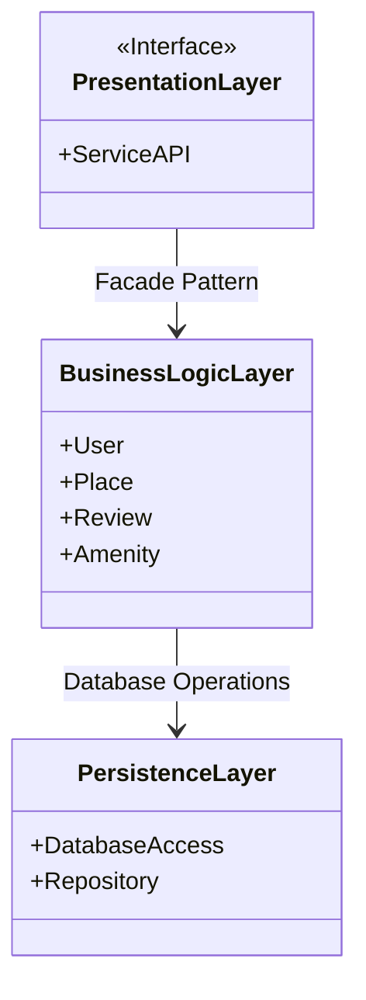
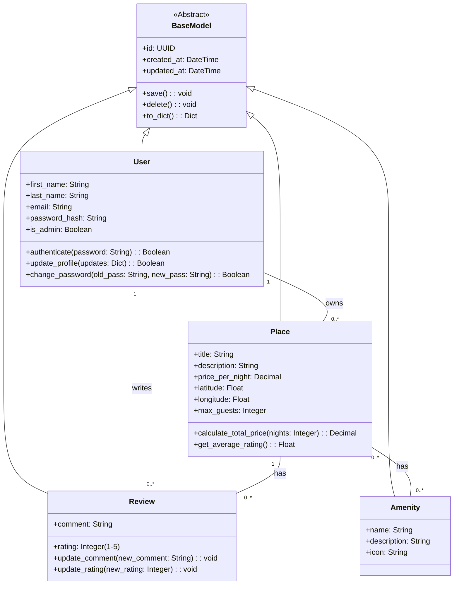
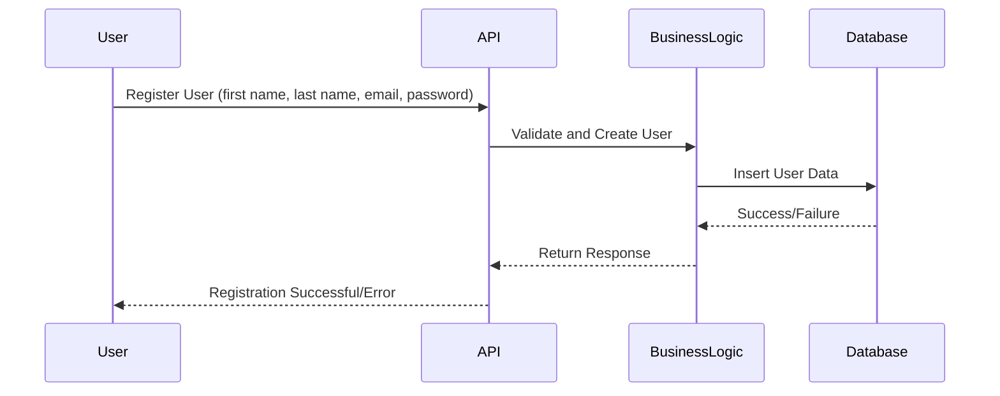
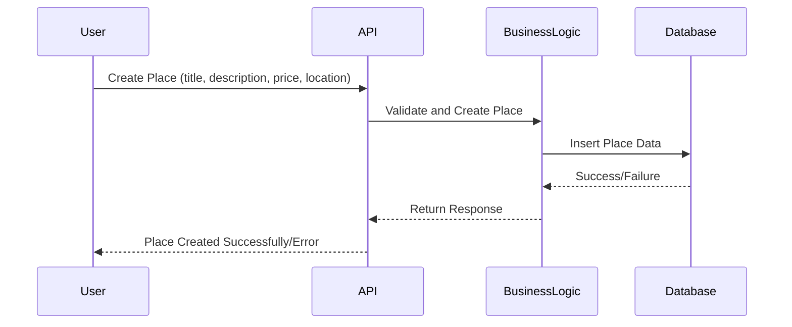
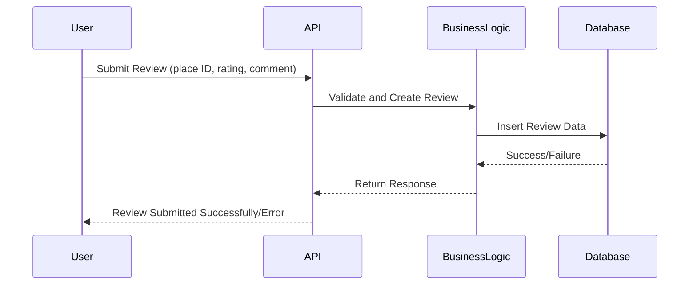
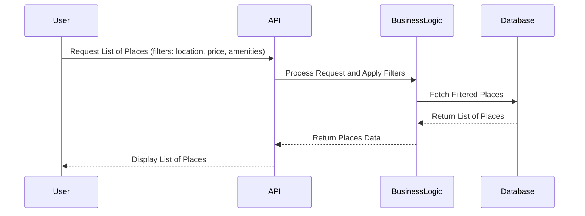

# HBnB Evolution – Technical Documentation

## 📘 Introduction
This document provides a comprehensive technical overview of the HBnB Evolution application.  
It compiles all major architecture diagrams and explanations developed throughout the project.  
The goal is to guide the implementation process by providing a clear reference for the application’s design and logic.

---

## 🗂️ High-Level Architecture

### High-Level Package Diagram

**Explanation:**
- The system is divided into three layers: Presentation, Business Logic, and Persistence.
- Each layer has a specific role and communicates with the others using defined patterns.
- The `Facade Pattern` simplifies the interface between the Presentation and Business Logic layers.
- The Business Logic Layer communicates with the Persistence Layer using repositories and database operations.

---

## 🧩 Business Logic Layer - Class Diagram

**Explanation:**
- All entities inherit from `BaseModel`, which provides ID and timestamps.
- `User` owns `Place` and writes `Review`.
- `Place` has many `Review`s and `Amenity` objects.

---

## 🔁 Sequence Diagrams for API Calls

### 1. User Registration

### 2. Place Creation

### 3. Review Submission

### 4. Fetching a List of Places

---

## ✅ Conclusion
This document compiles all architectural, design, and interaction diagrams for the HBnB Evolution project.  
It serves as a solid reference for implementation, testing, and future maintenance.  
Using a layered structure, clear object-oriented models, and sequence diagrams, this blueprint ensures a maintainable and scalable application.

