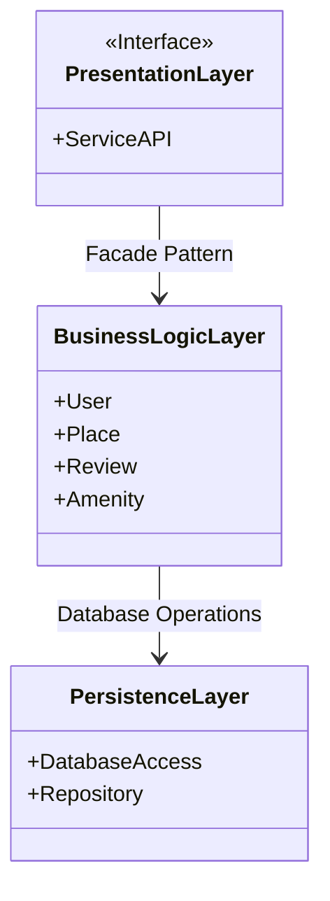
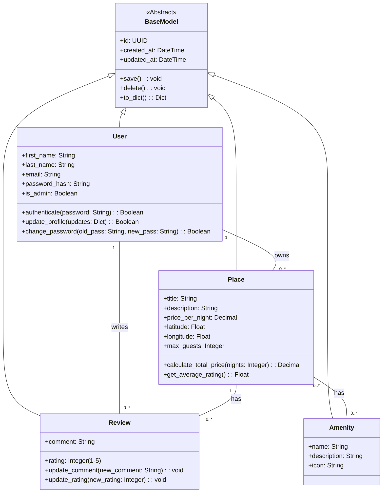
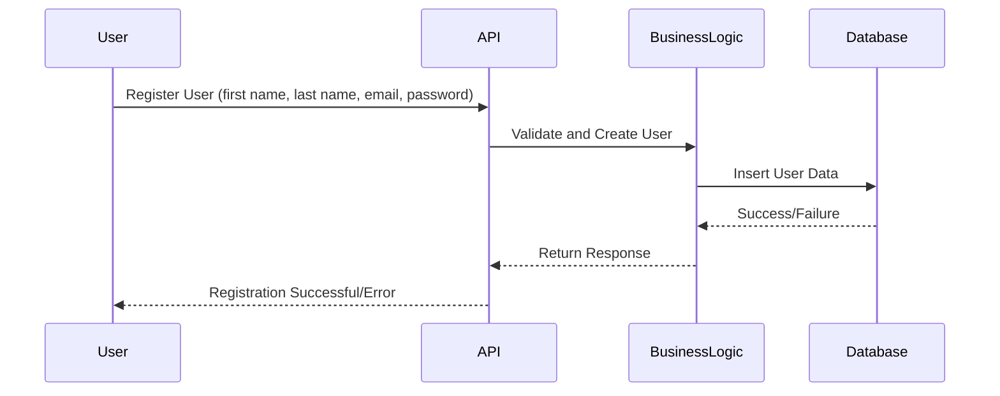
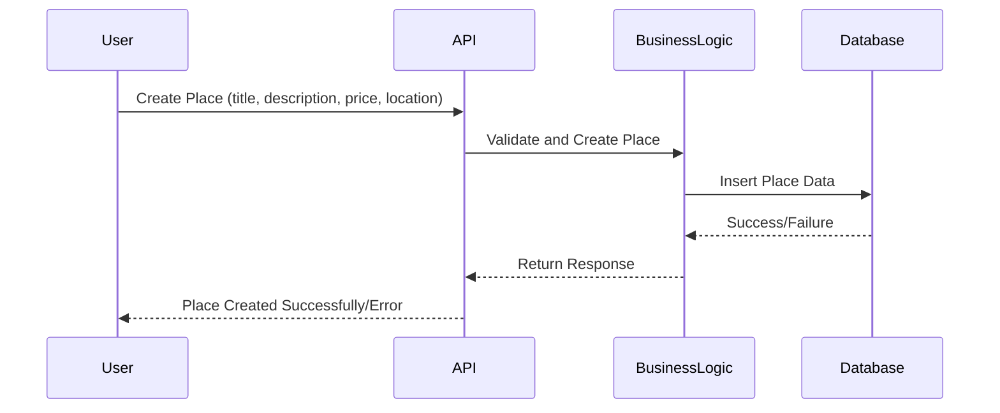
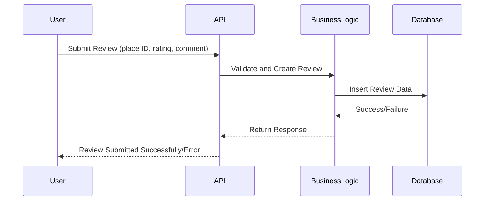
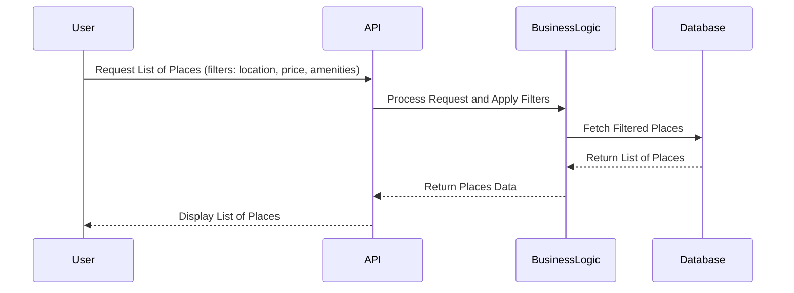

# HBnB Evolution – Technical Documentation

## 📘 Introduction

This document serves as the complete technical blueprint for the **HBnB Evolution** application. It consolidates the high-level architectural design, core data models, and API interaction flows using standardized UML diagrams. The goal is to provide clear and actionable documentation that guides implementation and future scaling.

---

## 📂 High-Level Architecture

### High-Level Package Diagram

**Explanation:**

* **Presentation Layer** handles user requests via a unified API interface.
* **Business Logic Layer** contains all domain models and core services.
* **Persistence Layer** communicates with the database to perform all CRUD operations.
* The layers follow a **Facade Pattern** for simplicity and separation of concerns.

---

## 🧩 Business Logic Layer – Class Diagram

**Explanation:**

* `BaseModel` provides shared fields like `id`, `created_at`, and `updated_at`.
* `User`, `Place`, `Review`, and `Amenity` extend `BaseModel`.
* Cardinal relationships enforce data constraints and clarify ownership.

---

## 🔄 Sequence Diagrams for API Calls

### 1. User Registration

### 2. Place Creation

### 3. Review Submission

### 4. Fetching a List of Places

---

## ✅ Conclusion

This technical documentation consolidates the architectural structure, object models, and user interactions for the HBnB Evolution platform. It adheres to UML standards and is designed to be a reference for developers, testers, and stakeholders across all development stages. The use of layered architecture and sequence flows ensures clarity, scalability, and maintainability of the system.

---

**Author:** 
- Abdulelah Alsheri
- Muhannad Gsgs
- Abdulaziz Alzahrani
