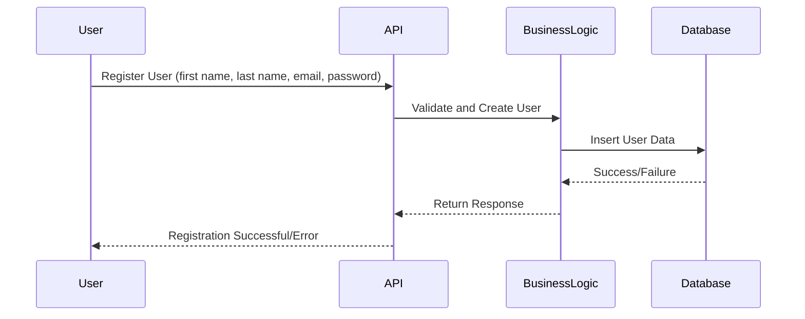
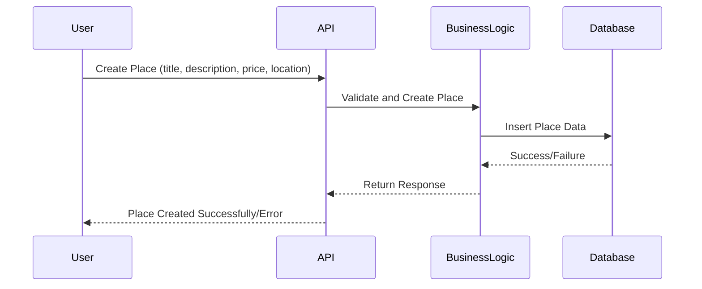
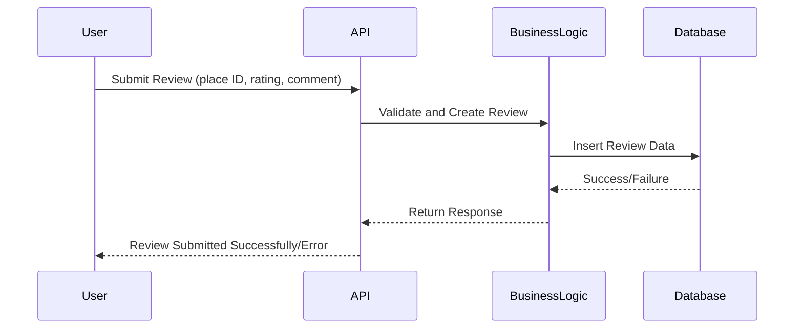
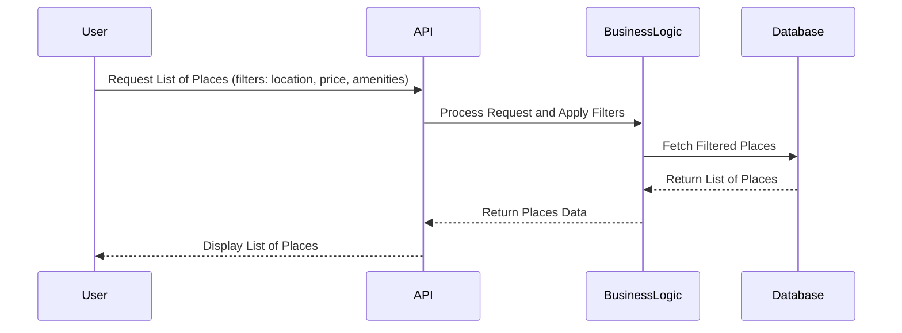

# Sequence Diagrams for API Calls

## Objective
The following sequence diagrams illustrate the interaction between the different layers (Presentation, Business Logic, and Persistence) in the HBnB Evolution application for handling various API calls.

## API Calls

### 1. User Registration

**Explanation:**  
- The user sends registration data (first name, last name, email, password) to the API.  
- The API forwards the request to the business logic layer for validation and creation.  
- The business logic layer interacts with the database to store the user data.  
- Once saved, a success or failure response is returned to the API and then back to the user.

### 2. Place Creation

**Explanation:**  
- The user submits place information (title, description, price, location) to the API.  
- The API validates the request and passes it to the business logic layer for processing.  
- The business logic layer stores the place data in the database.  
- After the database operation, a success or failure message is returned back to the user.

### 3. Review Submission

**Explanation:**  
- The user submits a review with details (place ID, rating, comment).  
- The API forwards the request to the business logic layer for validation and creation.  
- The business logic layer interacts with the database to store the review.  
- Once complete, a success or failure message is sent back to the user.

### 4. Fetching a List of Places

**Explanation:**  
- The user requests a list of places using filters (e.g., location, price, amenities).  
- The API forwards the request to the business logic layer, which applies the filters and queries the database.  
- The database returns a list of matching places.  
- The API sends the list back to the user.
